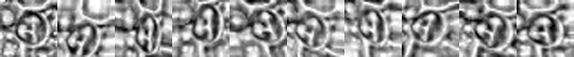
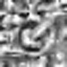
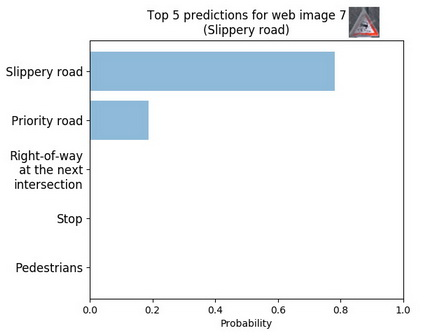

# **Traffic Sign Classifier** 

---

## Introduction

This project aims to train a convolution neural network as a traffic sign classifier.

The goals of this project are the following:
* Explore, summarize and visualize the data set
* Design, train and test a model architecture
* Use the model to make predictions on new images
* Analyze the softmax probabilities of the new images

Here is a link to my [project code](https://github.com/xinlinli1990/CarND-Traffic-Sign-Classifier-Project/tree/master/code)
and [Jupyter Notebook](https://github.com/xinlinli1990/CarND-Traffic-Sign-Classifier-Project/blob/master/Traffic_Sign_Classifier.ipynb)

## Dataset

I used the pandas library to calculate summary statistics of the traffic
signs data set:

* The size of training set is 34799
* The size of the validation set is 4410
* The size of test set is 12630
* The shape of a traffic sign image is (32, 32, 3)
* The number of unique classes/labels in the data set is 43

Then I counted the number of images for each traffic sign label and ploted the following bar chart showing the dataset distribution. 


It is obvious that some labels have much less images than others. Ideally, each class should have exactly equal number of instances. Therefore, data augmentation is necessary for this project. 

Then I visualized 10 images per label.


From the data visualzation aboved, the image dataset contain traffic sign labels shot in different lighting conditions. Part of them are blurred and occluded. 

The lighting condition introduce extra difficulty to the recognition of traffic signs. Take following three images as an example,

* *Image1* (X_train[200], label = 'end of no passing', lighting = dark)

  

* *Image2* (X_train[25556], label = 'keep left', lighting = dark)
  
  
  
* *Image3* (X_train[25560], label = 'keep left', lighting = bright)

  

Visually, image 1 and 2 are more similar than image 2 and 3, although the latter two images have indentical label. 

Mathematically, the histograms of image 1 and 2 are also much more similar than image 2 and 3. 

* Histograms of *Image1,2* and *3*

  
  
  

Thus, for better classfication accuracy, the pre-processing step should be introduced to reduce the difference from different lighting condition.

## Model Architecture

The training dataset is relatively small and unbalanced, thus I implemented an data augmentation pipeline based on skimage. The image augmentation function will generate new images by randomly apply rotation and projective transform on existing images.


```python
from skimage.transform import rotate
from skimage.transform import warp
from skimage.transform import ProjectiveTransform
from numpy import random

def data_augmentation(X_train, y_train, target):
    """
    This function receive training dataset X_train and labels y_train. 
    Args:
		X_train: Training dataset
		y_train: Training dataset labels
		target: Target number of training data for each label
    Returns:
        ret_X_train: New training dataset after data augmentation
		ret_y_train: New training dataset labels after data augmentation
    Raises:
    """
    
    labels, counts = np.unique(y_train, return_counts=True)
    
    X_aug = []
    y_aug = []
    
    for label, count in zip(labels, counts):
		# generate (target - count) new images
        augmentation_num = target - count
        X_train_label = X_train[y_train == label]

        for i in range(augmentation_num):
            # pick a random image from X_train_label
            img = X_train_label[np.random.randint(count)]
            # image augmentation
            intensity = 0.75
            img = single_image_augmentation(img, intensity)
            
            X_aug.append(img)
            y_aug.append(label)
    
    # Append new data to X_train.    
    ret_X_train = np.concatenate((X_train, np.array(X_aug)), axis=0)
    ret_y_train = np.concatenate((y_train, np.array(y_aug)), axis=0)

    return ret_X_train, ret_y_train

def single_image_augmentation(img, intensity):
    """
    This function receive one original image and randomly generate one new image based on given intensity
    Args:
        img: input image
        intensity: intensity of rotation and projective transform
    Returns:
        img: output image
    Raises:
    """

    img = rotate_img(img, intensity)
    img = projective_transform(img, intensity)

    return img

def rotate_img(img, intensity):
    delta = 30. * intensity 
    img = rotate(img, random.uniform(-delta, delta), mode='edge')
    return img

def projective_transform(img, intensity):
    image_x_size = img.shape[0]
    image_y_size = img.shape[1]

    dx = image_x_size * 0.3 * intensity
    dy = image_y_size * 0.3 * intensity

    tl_top = random.uniform(-dy, dy)
    tl_left = random.uniform(-dx, dx)
    bl_bottom = random.uniform(-dy, dy)
    bl_left = random.uniform(-dx, dx)
    tr_top = random.uniform(-dy, dy)
    tr_right = random.uniform(-dx, dx)
    br_bottom = random.uniform(-dy, dy)
    br_right = random.uniform(-dx, dx)

    transform = ProjectiveTransform()
            
    transform.estimate(
        np.array((
            (tl_left, tl_top),
            (bl_left, image_x_size - bl_bottom),
            (image_y_size - br_right, image_x_size - br_bottom),
            (image_y_size - tr_right, tr_top))),
        np.array((
            (0, 0),
            (0, image_x_size),
            (image_y_size, image_x_size),
            (image_y_size, 0))))    

    img = warp(img, transform, mode='edge')
    img = (img * 255).astype(np.uint8)
    return img
```

This is one example before and after data augmentation.


After data augmentation, all traffic sign labels have identical number of images.


From previous data visualization step, we can see that some traffic sign data are shot in very bad lighting condition. Visually, images of different traffic signs shot in dark enviroment could be more similar than images of the same traffic sign shot in dark and bright lighting conditions. Mathematically, the histograms of dark images are more similar than the histograms of different traffic sign image. Thus, in the data pre-processing step, I try to standardized the lighting conditions for all images to improve the classification performance of neural network.

In this project, the pre-processed step converted the raw images into grayscale images and then apply the Contrast-limited Adaptive Histogram Equalization (CLAHE) on them.

```python
def data_preprocessing(X_train, y_train):
    """
    This function convert all input images into grayscale, then apply Contrast Limited Adaptive Histogram Equalization (CLAHE) to enhance traffic sign feature.
    Args:
        X_train: input images
        y_train: input labels
    Returns:
        X_train: output images
        y_train: output labels
    Raises:
    """

    tmp_X_train = []
    
    for i in range(X_train.shape[0]):
        img = X_train[i]
        img = cv2.cvtColor(img, cv2.COLOR_RGB2GRAY)
        clahe = cv2.createCLAHE(clipLimit=2.0, tileGridSize=(8,8))
        img = clahe.apply(img)
        tmp_X_train.append(img[:,:,np.newaxis])
    
    X_train = np.array(tmp_X_train)

    X_train, y_train = data_normalization(X_train, y_train)

    X_train, y_train = shuffle(X_train, y_train)

    return X_train, y_train
```

The traffic signs are converted in to grayscale images due to following reasons,
* Firstly, compared with 3 color channels in the raw RGB images, grayscale images only have one color channel. Grayscale step reduced the dimensions of the data classification problem.
* Secondly, they are still easily distinguishable by eye after converted into grayscale images. and they  Thus, the grayscale step simplified the classification problem. Grayscale images make the model easier to train and more robust.

Then the CLAHE standardize the image lighting condition by redistributing the histogram of images. 
	


From the examples below, we can see that the difference from lighting condition are reduced by the pre-processing step.

* Original *Image 1,2* and *3*

  
  
  	

* Pre-proceessed *Image 1,2* and *3*

  
  
  

* Histograms of original and pre-processed *Image1,2* and *3* 

  *Original images (Left), Pre-processed images (right)*
  
  
  
  
  
  
  

Thus, the pre-processing step enhanced the geometric features of traffic sign and suppressed the enviromental lighting difference. After applied the CLAHE, the traffic signs are easier for visually recognition. Mathematically, it standardized the histogram distribution of input image, make the neural network easier to train.

In the end, all image data normalized to the range of -0.5 and 0.5.

```python
def data_normalization(X_train, y_train):
    """
    Args:
        X_train: input images
        y_train: input labels
    Returns:
        ret_X_train: output images
        ret_y_train: output labels
    Raises:
    """
    
    ret_X_train = (X_train.astype(float) - 128) / 256
    ret_y_train = y_train
    
    return ret_X_train, ret_y_train
```

## Model

### Model architecture

My final model consisted of the following layers:

The input data is pre-processed images whose dimension is 32x32x1. 

Three convolution modules extract features from images. 

* A typical convolution module contains following layers,	
  1. Input from previous layer
  2. One or two convolution layers, use RELU as activation function
  3. One Concat layer which allows input bypass the convolution layers
  4. One max pooling layer

  *The Concat layer concatenate input and the output from max pooling layer. It allows the neural network bypass certain convolutional layers so the model have richer solution space and it can determine the optimal depth of the neural network on its own.*
  
After the convolution modules, the features are flattened and passed through two fully connected layers. Dropout and Batch Normalization are implemented in the fully connected layers to avoid overfitting. All weights of convolution layers and fully connected layers are implemented L2 regularization. Xavier initializer was chosen to initialize the weights of all layers.


| Layer Name   | Layer Type			  	  |     Description	                           | 
|:------------:|:------------------------:|:------------------------------------------:| 
|input_data    | Input	                  | 32x32x1 pre-processed image                | 
|conv2d_11     | Convolution 3x3          | 1x1 stride, same padding, outputs 32x32x3  |
|              | ReLU					  |											   |
|conv2d_12     | Convolution 3x3          | 1x1 stride, same padding, outputs 32x32x6  |
|              | ReLU					  |											   |
|concat_1      | Concat     	      	  |[conv2d_12, input_data], outputs 32x32x7    |
|max_pool_1    | Max pooling	      	  | 2x2 stride,  outputs 16x16x7               |
|conv2d_21     | Convolution 4x4          | 1x1 stride, same padding, outputs 16x16x8  |
|              | ReLU					  |											   |
|conv2d_22     | Convolution 4x4          | 1x1 stride, same padding, outputs 16x16x16 |
|              | ReLU					  |											   |
|concat_2      | Concat     	      	  |[conv2d_22, max_pool_1], outputs 16x16x23   |
|max_pool_2    | Max pooling	      	  | 2x2 stride,  outputs 8x8x23                |
|conv2d_3      | Convolution 3x3          | 1x1 stride, same padding, outputs 8x8x32   |
|              | ReLU					  |											   |
|concat_3      | Concat     	          |[conv2d_31, max_pool_2], outputs 8x8x55     |
|max_pool_3    | Max pooling	          | 2x2 stride,  outputs 4x4x55                |
|conv2d_4      | Convolution 3x3          | 1x1 stride, valid padding, outputs 2x2x128 |
|fc_0          | Flatten                  | Flatten, outputs 512	                   |
|fc_1          | Fully connected	      | inputs 512, outputs 1024				   |
|              | Batch Normalization      |					                           |
|              | ReLU                     |					                           |
|              | Dropout                  |	Keep_prob = 0.75                           |
|fc_2          | Fully connected	      | inputs 1024, outputs 43				       |
|              | Batch Normalization      |					                           |
|              | Dropout                  |	Keep_prob = 0.75                           |
|              | Softmax                  | Prediction probability                     |	
 


### Model training hyperparamters

**Adam optimizer** was used to train the model and **learning rate** was fixed at **5e-3** since it works well. **batch size** set to **128**. After several simple tests, **Dropout keep probability** set to **75%** and **L2 regularization constant** set to **1e-5**. I trained **50 epochs** and keep the best solution which achieve highest accuracy in validation dataset.

### Determine model architecture

The starting point of my own model is LeNet. I added dropout into LeNet with 80% keep prob, the neural network achieved 93% validation accuracy. 

Then I try to add more interesting neural network structure into my model. 

Firstly, I implemented Google inception module V4 and use it to replace the convolution layers of LeNet. The results shows it's a bad idea. The model have serious overfitting even use very strict regularization parameters. 

To reduce the overfitting, I need to reduce the model capacity. So all branches in the inception module except for the double 3x3 convolution branch were removed and batch normalizations were added in the fully connected layers to replace their bias variables. After some small tuning on the fully connected layer, I get my final model.

For every new architectures, I test them with following steps:

1. Set L2 regularization constant to 0 and dropout keep_prob set to 1.
2. Check the validity of initial training loss to make sure the implementation of neural network is correct	
 *For a random initialized model classifying 43 classes problem, the initial training loss should be close to (-ln(1/43)) computed by softmax function*
3. After verified the correctness of implementation. Try to overfit a small training set (like 20 images) and we can roughly determine learning rate range.
4. Train with whole training set and determine the best learning rate. If the flutuation of training loss is too high, try to increase batch size or decrease learning rate.
5. If the model can overfit full training data, use more strict regularization parameters (Dropout, L2, Add batch normalization).

A grid search was conducted to find out the best regularization parameters for this model. Each combination of parameters were tested with 50 EPOCHS then preserve the best solution which achieve best accuracy in validation dataset.

|Max Validation Accuracy      |L2 regularization = 0.0|1e-5       |1e-4         |1e-3       |
|:---------------------------:|:---------------------:|:---------:|:-----------:|:---------:|
| **Dropout keep prob = 0.25**|***0.983446712***          |0.976643991|0.975510203  |0.959183674|
| **0.5** 			          |***0.980725623***          |0.979365079|***0.980045351***|0.96371882 |
| **0.75**       	          |***0.983446712***          |0.979365078|0.978458049  |0.966666667|

The following table shows the difference between training loss and validation loss *at the epoch of maximum validation accuracy*. Negative value indicate slightly underfitting while positive value indicate overfitting.

|Train_Loss - Valid_Loss      |L2 regularization = 0.0|1e-5        |1e-4        |1e-3        |
|:---------------------------:|:---------------------:|:----------:|:----------:|:----------:|
| **Dropout keep prob = 0.25**|-0.032369193           |-0.028737014|-0.032393924|-0.026121658|
| **0.5** 			          |-0.010655855           |-0.016217793|-0.015595739|-0.012393239|
| **0.75**       	          |***-0.001136635***         |***0.001495387***|***0.002751253***|***0.001333333***|

Based on the grid search result, the regularization parameters are fixed to dropout keep_prob 0.75 and l2 regularization 1e-5. Since it has highest validation accuracy and lowest positive different between train loss and valid loss.

In the end, evaluate the accuracy and loss on the testing dataset and achieve 0.96357878 accuracy.

My final model results were:
* training set accuracy of 98.82%
* validation set accuracy of 98.80%
* test set accuracy of 96.36%

### Test Final Model on New Images

Here are seven German traffic signs that I found on the web:


	

	


* The first two images include complete and clear traffic signs. They should be recognized by the neural networ easily.	
* The third image has incorrect color and the forth image has tree background which is a noisy texture.	
* The images in the third line might be difficult to classify because they are dusty and the traffic signs are partly occluded.

---

Here are the results of the prediction:

| Image			        |     Prediction	        					| Top probability |
|:---------------------:|:---------------------------------------------:|:---:|
| 100 km/h      		| 100 km/h 									|    89.7%|
| Slippery road | Slippery road 										| 99.4%|
| Right-of-way at the next intersection|  Right-of-way at the next intersection	| 83.9% |
| Bumpy Road      		| Bumpy Road				 				| 39.5% |
| **Beware of ice/snow**	| **Slippery Road**      					| 94.1% |
| **Children crossing**		| **Road narrows on the right**   			| 51.3% |
| Slippery Road			| Slippery Road      					| 78.1% |

* The model was able to correctly guess 5 of the 7 traffic signs, which gives an accuracy of 72%. The accuracy for online images is significantly lower than testing dataset (96.3%)
since it's a small dataset and tough images were specifically selected to test the limits of the model. 
* The model shows good performance on the complete and clear traffic sign images (image 1 and 2).	
* Due to the grayscale step in the pre-processing, the model focus on the texture features rather than color features, thus it works very well in the prediction of image 3 (Incorrect color)
but not so good with image 4 (noisy background texture). 
From this results, I believed the model performance could be improved by introduce "adding Gaussian noisy" or "adding Salt-and-pepper noise" into the data augmentation step.	
* From the results of image 5,6 and 7, we can see the model have problems when dealing with the recognition of dusty or partly occluded traffic signs.
The defects might be solved by adding more "dusty traffic sign" images into training set or adding "random crop" into the data augmentation pipeline.

#### Top 5 softmax probabilities for each image

The code for making predictions on my final model is located in **"./code/evaluate_single_image.py"**.




